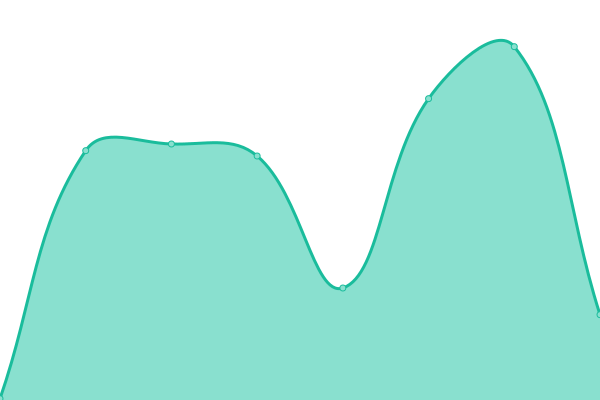

# [📈 Live Status](https://demo.upptime.js.org): <!--live status--> **🟧 Partial outage**

This repository contains the open-source uptime monitor and status page for [Rizky Haksono](https://rizkyhaksono.natee.my.id), powered by [Upptime](https://github.com/upptime/upptime).

With [Upptime](https://upptime.js.org), you can get your own unlimited and free uptime monitor and status page, powered entirely by a GitHub repository. We use [Issues](https://github.com/rizkyhaksono/upptime/issues) as incident reports, [Actions](https://github.com/rizkyhaksono/upptime/actions) as uptime monitors, and [Pages](https://demo.upptime.js.org) for the status page.

<!--start: status pages-->
<!-- This summary is generated by Upptime (https://github.com/upptime/upptime) -->
<!-- Do not edit this manually, your changes will be overwritten -->
<!-- prettier-ignore -->
| URL | Status | History | Response Time | Uptime |
| --- | ------ | ------- | ------------- | ------ |
|  [Portfolio](https://www.natee.my.id) | 🟩 Up | [portfolio.yml](https://github.com/rizkyhaksono/uptime/commits/HEAD/history/portfolio.yml) | 

 267ms
     
 | 

<a href="https://uptime.natee.my.id/history/portfolio">100.00%</a>
    

|  [Smart Recycling](https://smartrecycling.natee.my.id) | 🟩 Up | [smart-recycling.yml](https://github.com/rizkyhaksono/uptime/commits/HEAD/history/smart-recycling.yml) | 

 136ms
     
 | 

<a href="https://uptime.natee.my.id/history/smart-recycling">100.00%</a>
    

|  [Otakudesu Backend API](https://api.otakudesu.natee.my.id/api) | 🟩 Up | [otakudesu-backend-api.yml](https://github.com/rizkyhaksono/uptime/commits/HEAD/history/otakudesu-backend-api.yml) | 

 285ms
     
 | 

<a href="https://uptime.natee.my.id/history/otakudesu-backend-api">100.00%</a>
    

|  [Otakudesu Frontend](https://otakudesu.natee.my.id) | 🟩 Up | [otakudesu-frontend.yml](https://github.com/rizkyhaksono/uptime/commits/HEAD/history/otakudesu-frontend.yml) | 

 273ms
     
 | 

<a href="https://uptime.natee.my.id/history/otakudesu-frontend">100.00%</a>
    

|  [Otakudesu Docs](https://otakudesudocs.natee.my.id) | 🟩 Up | [otakudesu-docs.yml](https://github.com/rizkyhaksono/uptime/commits/HEAD/history/otakudesu-docs.yml) | 

 115ms
     
 | 

<a href="https://uptime.natee.my.id/history/otakudesu-docs">100.00%</a>
    

|  [Apel Manis](https://apelmanis.natee.my.id) | 🟩 Up | [apel-manis.yml](https://github.com/rizkyhaksono/uptime/commits/HEAD/history/apel-manis.yml) | 

 182ms
     
 | 

<a href="https://uptime.natee.my.id/history/apel-manis">100.00%</a>
    

|  [Info Gempa](https://gempa.natee.me/) | 🟩 Up | [info-gempa.yml](https://github.com/rizkyhaksono/uptime/commits/HEAD/history/info-gempa.yml) | 

 3591ms
     
 | 

<a href="https://uptime.natee.my.id/history/info-gempa">100.00%</a>
    

|  [NestJS Inventory API](https://inventory.natee.me/api) | 🟥 Down | [nest-js-inventory-api.yml](https://github.com/rizkyhaksono/uptime/commits/HEAD/history/nest-js-inventory-api.yml) | 

 9612ms
     
 | 

<a href="https://uptime.natee.my.id/history/nest-js-inventory-api">93.67%</a>
    

|  [Mahati Admin](https://mahati.natee.me) | 🟩 Up | [mahati-admin.yml](https://github.com/rizkyhaksono/uptime/commits/HEAD/history/mahati-admin.yml) | 

 138ms
     
 | 

<a href="https://uptime.natee.my.id/history/mahati-admin">100.00%</a>
    

|  [Mahati API](https://mahati.xyzuan.my.id) | 🟩 Up | [mahati-api.yml](https://github.com/rizkyhaksono/uptime/commits/HEAD/history/mahati-api.yml) | 

 798ms
     
 | 

<a href="https://uptime.natee.my.id/history/mahati-api">100.00%</a>
    

|  [Google DNS 8.8.8.8](8.8.8.8) | 🟩 Up | [google-dns-8-8-8-8.yml](https://github.com/rizkyhaksono/uptime/commits/HEAD/history/google-dns-8-8-8-8.yml) | 

 4ms
     
 | 

<a href="https://uptime.natee.my.id/history/google-dns-8-8-8-8">100.00%</a>
    

<!--end: status pages-->

[**Visit our status website →**](https://demo.upptime.js.org)

## 📄 License

- Powered by: [Upptime](https://github.com/upptime/upptime)
- Code: [MIT](./LICENSE) © [Anand Chowdhary](https://anandchowdhary.com), supported by [Pabio](https://pabio.com)
- Data in the `./history` directory: [Open Database License](https://opendatacommons.org/licenses/odbl/1-0/)
