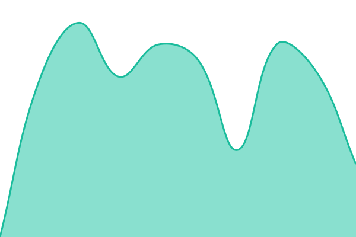

# [📈 Live Status](https://demo.upptime.js.org): <!--live status--> **🟧 Partial outage**

This repository contains the open-source uptime monitor and status page for [Rizky Haksono](https://rizkyhaksono.natee.my.id), powered by [Upptime](https://github.com/upptime/upptime).

With [Upptime](https://upptime.js.org), you can get your own unlimited and free uptime monitor and status page, powered entirely by a GitHub repository. We use [Issues](https://github.com/rizkyhaksono/upptime/issues) as incident reports, [Actions](https://github.com/rizkyhaksono/upptime/actions) as uptime monitors, and [Pages](https://demo.upptime.js.org) for the status page.

<!--start: status pages-->
<!-- This summary is generated by Upptime (https://github.com/upptime/upptime) -->
<!-- Do not edit this manually, your changes will be overwritten -->
<!-- prettier-ignore -->
| URL | Status | History | Response Time | Uptime |
| --- | ------ | ------- | ------------- | ------ |
|  [Uptime Monitor v1](https://stats.uptimerobot.com/RlWv1DOX9w) | 🟩 Up | [uptime-monitor-v1.yml](https://github.com/rizkyhaksono/uptime/commits/HEAD/history/uptime-monitor-v1.yml) | 

 660ms
     
 | 

<a href="https://uptime.natee.my.id/history/uptime-monitor-v1">100.00%</a>
    

|  [Uptime Monitor v2](https://status.natee.my.id/status/natee) | 🟩 Up | [uptime-monitor-v2.yml](https://github.com/rizkyhaksono/uptime/commits/HEAD/history/uptime-monitor-v2.yml) | 

 1788ms
     
 | 

<a href="https://uptime.natee.my.id/history/uptime-monitor-v2">100.00%</a>
    

|  [Portfolio (.my.id)](https://natee.my.id) | 🟥 Down | [portfolio-my-id.yml](https://github.com/rizkyhaksono/uptime/commits/HEAD/history/portfolio-my-id.yml) | 

 3333ms
     
 | 

<a href="https://uptime.natee.my.id/history/portfolio-my-id">92.09%</a>
    

|  [Portfolio API v3](https://api.natee.my.id/docs) | 🟩 Up | [portfolio-api-v3.yml](https://github.com/rizkyhaksono/uptime/commits/HEAD/history/portfolio-api-v3.yml) | 

 1150ms
     
 | 

<a href="https://uptime.natee.my.id/history/portfolio-api-v3">100.00%</a>
    

|  [Otakudesu API](https://api.otakudesu.natee.my.id/api) | 🟩 Up | [otakudesu-api.yml](https://github.com/rizkyhaksono/uptime/commits/HEAD/history/otakudesu-api.yml) | 

 816ms
     
 | 

<a href="https://uptime.natee.my.id/history/otakudesu-api">100.00%</a>
    

|  [Otakudesu Frontend](https://otakudesu.natee.my.id) | 🟩 Up | [otakudesu-frontend.yml](https://github.com/rizkyhaksono/uptime/commits/HEAD/history/otakudesu-frontend.yml) | 

 1082ms
     
 | 

<a href="https://uptime.natee.my.id/history/otakudesu-frontend">100.00%</a>
    

|  [Apel Manis](https://apelmanis.natee.my.id) | 🟩 Up | [apel-manis.yml](https://github.com/rizkyhaksono/uptime/commits/HEAD/history/apel-manis.yml) | 

 404ms
     
 | 

<a href="https://uptime.natee.my.id/history/apel-manis">100.00%</a>
    

|  [Info Gempa](https://gempa.natee.my.id) | 🟩 Up | [info-gempa.yml](https://github.com/rizkyhaksono/uptime/commits/HEAD/history/info-gempa.yml) | 

 2512ms
     
 | 

<a href="https://uptime.natee.my.id/history/info-gempa">100.00%</a>
    

|  [Mahati Admin](https://mahati.natee.my.id) | 🟩 Up | [mahati-admin.yml](https://github.com/rizkyhaksono/uptime/commits/HEAD/history/mahati-admin.yml) | 

 413ms
     
 | 

<a href="https://uptime.natee.my.id/history/mahati-admin">100.00%</a>
    

|  [Nginx Natee](https://nginx.natee.my.id) | 🟩 Up | [nginx-natee.yml](https://github.com/rizkyhaksono/uptime/commits/HEAD/history/nginx-natee.yml) | 

 1236ms
     
 | 

<a href="https://uptime.natee.my.id/history/nginx-natee">100.00%</a>
    

|  [Portainer Natee](https://portainer.natee.my.id) | 🟩 Up | [portainer-natee.yml](https://github.com/rizkyhaksono/uptime/commits/HEAD/history/portainer-natee.yml) | 

 1238ms
     
 | 

<a href="https://uptime.natee.my.id/history/portainer-natee">100.00%</a>
    

|  [serahweb](https://serahweb.com) | 🟥 Down | [serahweb.yml](https://github.com/rizkyhaksono/uptime/commits/HEAD/history/serahweb.yml) | 

 0ms
     
 | 

<a href="https://uptime.natee.my.id/history/serahweb">0.00%</a>
    

<!--end: status pages-->

[**Visit our status website →**](https://demo.upptime.js.org)

## 📄 License

- Powered by: [Upptime](https://github.com/upptime/upptime)
- Code: [MIT](./LICENSE) © [Anand Chowdhary](https://anandchowdhary.com), supported by [Pabio](https://pabio.com)
- Data in the `./history` directory: [Open Database License](https://opendatacommons.org/licenses/odbl/1-0/)
