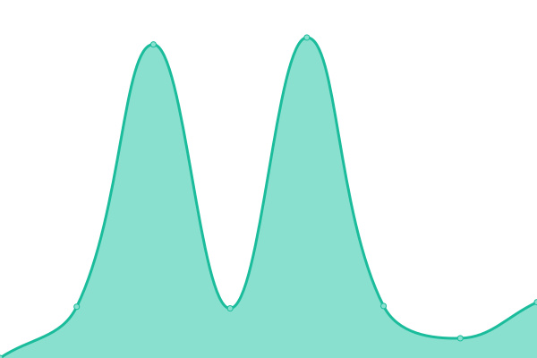

# [📈 Live Status](https://demo.upptime.js.org): <!--live status--> **🟧 Partial outage**

This repository contains the open-source uptime monitor and status page for [Rizky Haksono](https://rizkyhaksono.natee.my.id), powered by [Upptime](https://github.com/upptime/upptime).

With [Upptime](https://upptime.js.org), you can get your own unlimited and free uptime monitor and status page, powered entirely by a GitHub repository. We use [Issues](https://github.com/rizkyhaksono/upptime/issues) as incident reports, [Actions](https://github.com/rizkyhaksono/upptime/actions) as uptime monitors, and [Pages](https://demo.upptime.js.org) for the status page.

<!--start: status pages-->
<!-- This summary is generated by Upptime (https://github.com/upptime/upptime) -->
<!-- Do not edit this manually, your changes will be overwritten -->
<!-- prettier-ignore -->
| URL | Status | History | Response Time | Uptime |
| --- | ------ | ------- | ------------- | ------ |
|  [Uptime Monitor v2](https://stats.uptimerobot.com/RlWv1DOX9w) | 🟩 Up | [uptime-monitor-v2.yml](https://github.com/rizkyhaksono/uptime/commits/HEAD/history/uptime-monitor-v2.yml) | 

 562ms
     
 | 

<a href="https://uptime.natee.my.id/history/uptime-monitor-v2">100.00%</a>
    

|  [Uptime Monitor v3](https://status.nateee.com/status/all) | 🟥 Down | [uptime-monitor-v3.yml](https://github.com/rizkyhaksono/uptime/commits/HEAD/history/uptime-monitor-v3.yml) | 

 1971ms
     
 | 

<a href="https://uptime.natee.my.id/history/uptime-monitor-v3">96.09%</a>
    

|  [Portfolio (.my.id)](https://natee.my.id) | 🟥 Down | [portfolio-my-id.yml](https://github.com/rizkyhaksono/uptime/commits/HEAD/history/portfolio-my-id.yml) | 

 3162ms
     
 | 

<a href="https://uptime.natee.my.id/history/portfolio-my-id">90.17%</a>
    

|  [Portfolio (.com)](https://nateee.com) | 🟥 Down | [portfolio-com.yml](https://github.com/rizkyhaksono/uptime/commits/HEAD/history/portfolio-com.yml) | 

 2245ms
     
 | 

<a href="https://uptime.natee.my.id/history/portfolio-com">90.26%</a>
    

|  [Portfolio (.io)](https://nateon.io) | 🟥 Down | [portfolio-io.yml](https://github.com/rizkyhaksono/uptime/commits/HEAD/history/portfolio-io.yml) | 

 2422ms
     
 | 

<a href="https://uptime.natee.my.id/history/portfolio-io">90.20%</a>
    

|  [Portfolio API v3](https://api.natee.my.id/swagger) | 🟩 Up | [portfolio-api-v3.yml](https://github.com/rizkyhaksono/uptime/commits/HEAD/history/portfolio-api-v3.yml) | 

 2140ms
     
 | 

<a href="https://uptime.natee.my.id/history/portfolio-api-v3">97.47%</a>
    

|  [Smart Recycling Frontend](https://smartrecycling.natee.my.id) | 🟩 Up | [smart-recycling-frontend.yml](https://github.com/rizkyhaksono/uptime/commits/HEAD/history/smart-recycling-frontend.yml) | 

 198ms
     
 | 

<a href="https://uptime.natee.my.id/history/smart-recycling-frontend">99.65%</a>
    

|  [Smart Recycling Backend](https://api.smartrecycling.natee.my.id) | 🟥 Down | [smart-recycling-backend.yml](https://github.com/rizkyhaksono/uptime/commits/HEAD/history/smart-recycling-backend.yml) | 

 9439ms
     
 | 

<a href="https://uptime.natee.my.id/history/smart-recycling-backend">98.77%</a>
    

|  [Nateeflix API](https://api.flix.natee.my.id/swagger) | 🟥 Down | [nateeflix-api.yml](https://github.com/rizkyhaksono/uptime/commits/HEAD/history/nateeflix-api.yml) | 

 2540ms
     
 | 

<a href="https://uptime.natee.my.id/history/nateeflix-api">97.57%</a>
    

|  [Nateegami API](https://api.gami.natee.my.id/swagger) | 🟩 Up | [nateegami-api.yml](https://github.com/rizkyhaksono/uptime/commits/HEAD/history/nateegami-api.yml) | 

 6109ms
     
 | 

<a href="https://uptime.natee.my.id/history/nateegami-api">98.77%</a>
    

|  [Otakudesu API](https://api.otakudesu.natee.my.id/api) | 🟥 Down | [otakudesu-api.yml](https://github.com/rizkyhaksono/uptime/commits/HEAD/history/otakudesu-api.yml) | 

 742ms
     
 | 

<a href="https://uptime.natee.my.id/history/otakudesu-api">97.20%</a>
    

|  [Otakudesu Frontend](https://otakudesu.natee.my.id) | 🟩 Up | [otakudesu-frontend.yml](https://github.com/rizkyhaksono/uptime/commits/HEAD/history/otakudesu-frontend.yml) | 

 1848ms
     
 | 

<a href="https://uptime.natee.my.id/history/otakudesu-frontend">96.23%</a>
    

|  [Otakudesu Docs](https://otakudesudocs.natee.my.id) | 🟩 Up | [otakudesu-docs.yml](https://github.com/rizkyhaksono/uptime/commits/HEAD/history/otakudesu-docs.yml) | 

 209ms
     
 | 

<a href="https://uptime.natee.my.id/history/otakudesu-docs">99.62%</a>
    

|  [Apel Manis](https://apelmanis.natee.my.id) | 🟩 Up | [apel-manis.yml](https://github.com/rizkyhaksono/uptime/commits/HEAD/history/apel-manis.yml) | 

 241ms
     
 | 

<a href="https://uptime.natee.my.id/history/apel-manis">99.62%</a>
    

|  [Info Gempa](https://gempa.natee.my.id) | 🟩 Up | [info-gempa.yml](https://github.com/rizkyhaksono/uptime/commits/HEAD/history/info-gempa.yml) | 

 2462ms
     
 | 

<a href="https://uptime.natee.my.id/history/info-gempa">98.03%</a>
    

|  [NestJS Inventory API](https://inventory.natee.my.id/api) | 🟩 Up | [nest-js-inventory-api.yml](https://github.com/rizkyhaksono/uptime/commits/HEAD/history/nest-js-inventory-api.yml) | 

 1775ms
     
 | 

<a href="https://uptime.natee.my.id/history/nest-js-inventory-api">97.22%</a>
    

|  [NestJS Book API](https://api.book.natee.my.id/api) | 🟩 Up | [nest-js-book-api.yml](https://github.com/rizkyhaksono/uptime/commits/HEAD/history/nest-js-book-api.yml) | 

 2244ms
     
 | 

<a href="https://uptime.natee.my.id/history/nest-js-book-api">98.89%</a>
    

|  [Mahati Admin](https://mahati.natee.my.id) | 🟩 Up | [mahati-admin.yml](https://github.com/rizkyhaksono/uptime/commits/HEAD/history/mahati-admin.yml) | 

 163ms
     
 | 

<a href="https://uptime.natee.my.id/history/mahati-admin">99.60%</a>
    

|  [Mahati API](https://mahati.xyzuan.my.id) | 🟩 Up | [mahati-api.yml](https://github.com/rizkyhaksono/uptime/commits/HEAD/history/mahati-api.yml) | 

 820ms
     
 | 

<a href="https://uptime.natee.my.id/history/mahati-api">98.34%</a>
    

|  [Jenkins Natee](https://jenkins.natee.my.id/login?from=%2F) | 🟩 Up | [jenkins-natee.yml](https://github.com/rizkyhaksono/uptime/commits/HEAD/history/jenkins-natee.yml) | 

 2800ms
     
 | 

<a href="https://uptime.natee.my.id/history/jenkins-natee">97.81%</a>
    

|  [Nginx Natee](https://nginx.natee.my.id) | 🟩 Up | [nginx-natee.yml](https://github.com/rizkyhaksono/uptime/commits/HEAD/history/nginx-natee.yml) | 

 1030ms
     
 | 

<a href="https://uptime.natee.my.id/history/nginx-natee">97.37%</a>
    

|  [Portainer Natee](https://portainer.natee.my.id) | 🟩 Up | [portainer-natee.yml](https://github.com/rizkyhaksono/uptime/commits/HEAD/history/portainer-natee.yml) | 

 1805ms
     
 | 

<a href="https://uptime.natee.my.id/history/portainer-natee">97.54%</a>
    

|  [Company Intern FE](https://company.natee.my.id) | 🟩 Up | [company-intern-fe.yml](https://github.com/rizkyhaksono/uptime/commits/HEAD/history/company-intern-fe.yml) | 

 1297ms
     
 | 

<a href="https://uptime.natee.my.id/history/company-intern-fe">97.53%</a>
    

|  [Company Intern BE](https://api.company.natee.my.id/docs/api) | 🟥 Down | [company-intern-be.yml](https://github.com/rizkyhaksono/uptime/commits/HEAD/history/company-intern-be.yml) | 

 1501ms
     
 | 

<a href="https://uptime.natee.my.id/history/company-intern-be">97.02%</a>
    

|  [Venturo Vue FE](https://venturo.vue.natee.my.id) | 🟩 Up | [venturo-vue-fe.yml](https://github.com/rizkyhaksono/uptime/commits/HEAD/history/venturo-vue-fe.yml) | 

 4318ms
     
 | 

<a href="https://uptime.natee.my.id/history/venturo-vue-fe">98.66%</a>
    

|  [Venturo Vue BE](https://venturo.laravel.natee.my.id) | 🟥 Down | [venturo-vue-be.yml](https://github.com/rizkyhaksono/uptime/commits/HEAD/history/venturo-vue-be.yml) | 

 1384ms
     
 | 

<a href="https://uptime.natee.my.id/history/venturo-vue-be">97.31%</a>
    

|  [Short Link BE](https://api.link.natee.my.id/docs/api) | 🟥 Down | [short-link-be.yml](https://github.com/rizkyhaksono/uptime/commits/HEAD/history/short-link-be.yml) | 

 1568ms
     
 | 

<a href="https://uptime.natee.my.id/history/short-link-be">97.07%</a>
    

|  [Short Link FE](https://shortlink.natee.my.id) | 🟩 Up | [short-link-fe.yml](https://github.com/rizkyhaksono/uptime/commits/HEAD/history/short-link-fe.yml) | 

 2491ms
     
 | 

<a href="https://uptime.natee.my.id/history/short-link-fe">99.59%</a>
    

|  [Venturo Siakad BE](https://venturo.siakad.be.natee.my.id/docs/api) | 🟥 Down | [venturo-siakad-be.yml](https://github.com/rizkyhaksono/uptime/commits/HEAD/history/venturo-siakad-be.yml) | 

 5813ms
     
 | 

<a href="https://uptime.natee.my.id/history/venturo-siakad-be">97.08%</a>
    

|  [Venturo Siakad FE](https://venturo-siakad-fe.natee.my.id) | 🟥 Down | [venturo-siakad-fe.yml](https://github.com/rizkyhaksono/uptime/commits/HEAD/history/venturo-siakad-fe.yml) | 

 1624ms
     
 | 

<a href="https://uptime.natee.my.id/history/venturo-siakad-fe">96.27%</a>
    

|  [Natee RabbitMQ](https://rabbitmq.natee.my.id) | 🟥 Down | [natee-rabbit-mq.yml](https://github.com/rizkyhaksono/uptime/commits/HEAD/history/natee-rabbit-mq.yml) | 

 925ms
     
 | 

<a href="https://uptime.natee.my.id/history/natee-rabbit-mq">11.78%</a>
    

|  [NyanDrive Docs](https://docs.nyandrive.com) | 🟩 Up | [nyan-drive-docs.yml](https://github.com/rizkyhaksono/uptime/commits/HEAD/history/nyan-drive-docs.yml) | 

 808ms
     
 | 

<a href="https://uptime.natee.my.id/history/nyan-drive-docs">96.06%</a>
    

|  [Foundation React Devcom UMM](https://foundation.react.natee.my.id) | 🟩 Up | [foundation-react-devcom-umm.yml](https://github.com/rizkyhaksono/uptime/commits/HEAD/history/foundation-react-devcom-umm.yml) | 

 1925ms
     
 | 

<a href="https://uptime.natee.my.id/history/foundation-react-devcom-umm">97.56%</a>
    

|  [Venturo Reports FE](https://venturo.reports.fe.natee.my.id) | 🟩 Up | [venturo-reports-fe.yml](https://github.com/rizkyhaksono/uptime/commits/HEAD/history/venturo-reports-fe.yml) | 

 2108ms
     
 | 

<a href="https://uptime.natee.my.id/history/venturo-reports-fe">97.58%</a>
    

|  [serahweb (natee)](https://serahweb.nateee.com) | 🟥 Down | [serahweb-natee.yml](https://github.com/rizkyhaksono/uptime/commits/HEAD/history/serahweb-natee.yml) | 

 4042ms
     
 | 

<a href="https://uptime.natee.my.id/history/serahweb-natee">95.59%</a>
    

|  [serahweb (serah)](https://serahweb.com) | 🟥 Down | [serahweb-serah.yml](https://github.com/rizkyhaksono/uptime/commits/HEAD/history/serahweb-serah.yml) | 

 654ms
     
 | 

<a href="https://uptime.natee.my.id/history/serahweb-serah">95.44%</a>
    

|  [Natee Tracker](https://tracker.nateon.io) | 🟩 Up | [natee-tracker.yml](https://github.com/rizkyhaksono/uptime/commits/HEAD/history/natee-tracker.yml) | 

 900ms
     
 | 

<a href="https://uptime.natee.my.id/history/natee-tracker">99.62%</a>
    

<!--end: status pages-->

[**Visit our status website →**](https://demo.upptime.js.org)

## 📄 License

- Powered by: [Upptime](https://github.com/upptime/upptime)
- Code: [MIT](./LICENSE) © [Anand Chowdhary](https://anandchowdhary.com), supported by [Pabio](https://pabio.com)
- Data in the `./history` directory: [Open Database License](https://opendatacommons.org/licenses/odbl/1-0/)
